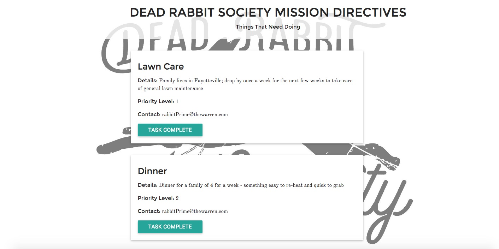
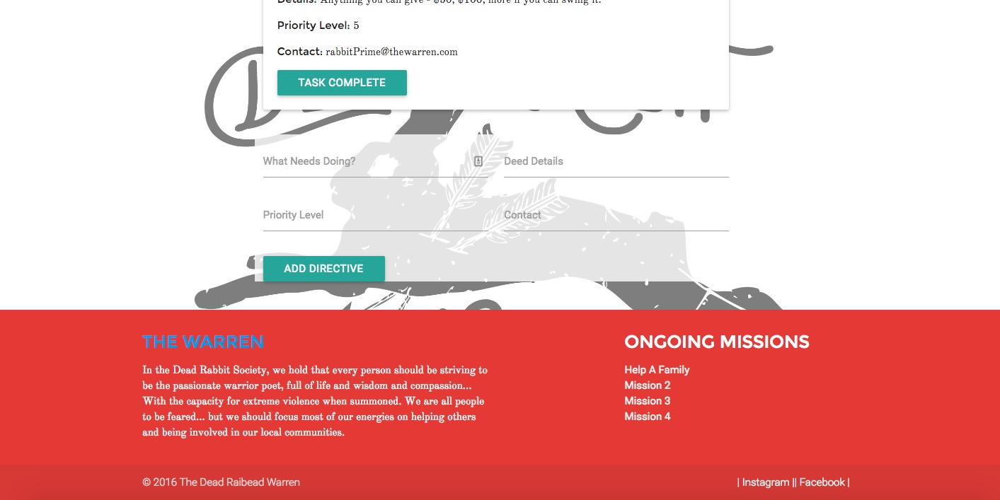

Dead Rabbit Society Project Manager README
------------------------------------------

### Introduction

This single page application is intended to be a project task manager for Dead Rabbit Society campaigns. The tasks are available as a JSON API. 

#### Log In Information

###### https://damp-forest-58528.herokuapp.com/ 
###### username:
###### password:

#### Screen Shots

#### Wireframes

#### User Story

The Dead Rabbit Society is a charity organization started by my brother-in-law as a grassrots way for his fellow former service members and likeminded individuals to help soldiers and veterans in need. This community needed a way to simply and quickly be able to identify tasks that need to be completed in any given mission (complete with whom is running point); need to be able to see which tasks take precedence; and need to be able to close tasks once they are done.

#### General Approach

My general approach to this task was to create the basic list functionality first, and then fiddle with Materialize to make everything pretty. 

#### Hurdles & Unsolved Problems
**Hurdles:** Getting the list items to delete was difficult, as was ordering the list. 

**Unsolved Problems:** My next step is to add user auth. 

#### Technologies Used

- NodeJS
- Express
- MongodB
- Mongoose

### Dependencies

- angular 1.4.9
- body-parser 1.15.1
- express 4.13.4
- ejs 2.4.1
- mongoose 4.4.19

### Installation 

1. Clone the GitHub repository.

2. Navigate to the main page of the repo and click  
   ⋅⋅**Clone or download**

3. Click the clipboard to copy the clone URL for the repository.

4. Open your CLI.

5. Cd into the location you want the cloned directory to live.

   ⋅⋅ `git clone` and paste the URL you have on the clipboard.
   Hit Enter.

6. To install the database:

   ⋅⋅ cd into the repository location
   ⋅⋅ run `mongod`
   ⋅⋅ open up a second tab in your Terminal and run `node server.js`

### Support 

Users looking for support should file an issue on the [GitHub issue tracking page] (https://github.com/cochrancj/DRS_Project_Manager/issues "Git Issue Tracking Page"), **or** [create a pull request] (https://github.com/cochrancj/DRS_Project_Manager/pulls "Create A Pull Request") if you have a fix you would like incorporated.
